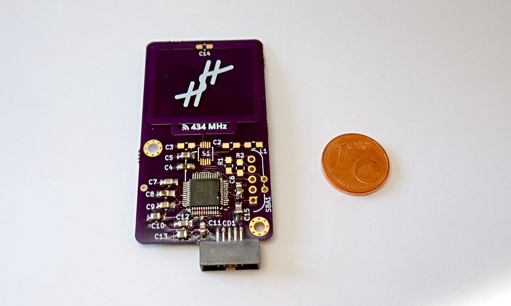

# First program
Today, I learned an interesting lesson: decoupling capacitors matter.

For the last few days, I had been stuck with a problem: reading from the MCU worked, but flashing a new program always failed.
I started going through all possible causes (OpenOCD configuration, physical connections, ...), but I could not find the cause of the problems.
Then I remembered reading recently that the decoupling capacitors are not only there to cope with ripples in the power supply, but also to smooth out the varying power demand of the MCU.
Therefore, I decided to add the decoupling capacitors and give the board another try:

```
> program sensor-node.hex verify
target halted due to debug-request, current mode: Thread
xPSR: 0x01000000 pc: 0x00000164 msp: 0x20001000
** Programming Started **
auto erase enabled
wrote 3072 bytes from file sensor-node.hex in 0.173291s (17.312 KiB/s)
** Programming Finished **
** Verify Started **
verified 2888 bytes in 0.036685s (76.879 KiB/s)
** Verified OK **
```

Fortunately this time everything worked without errors.

Coming from a background of working with Atmel 8-bit chips, which work quite well without decoupling, the solution to this problem was not all that obvious to me.
However, I think it was a valuable lesson in building robust designs.


