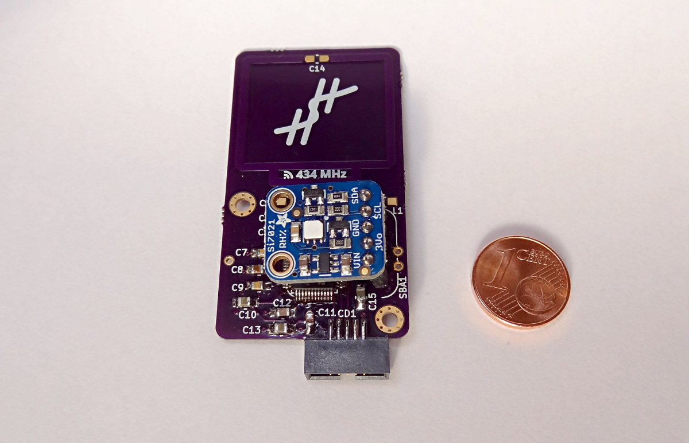

# Sensor added

I just added the I2C pull-ups and the sensor socket to the board.
For the time being, this is the final state of this version of the board.
There is no point in adding the radio components, as the pin assignment has to be corrected.
However, I can attach the sensor and test the communication between the sensor and the MCU now.

