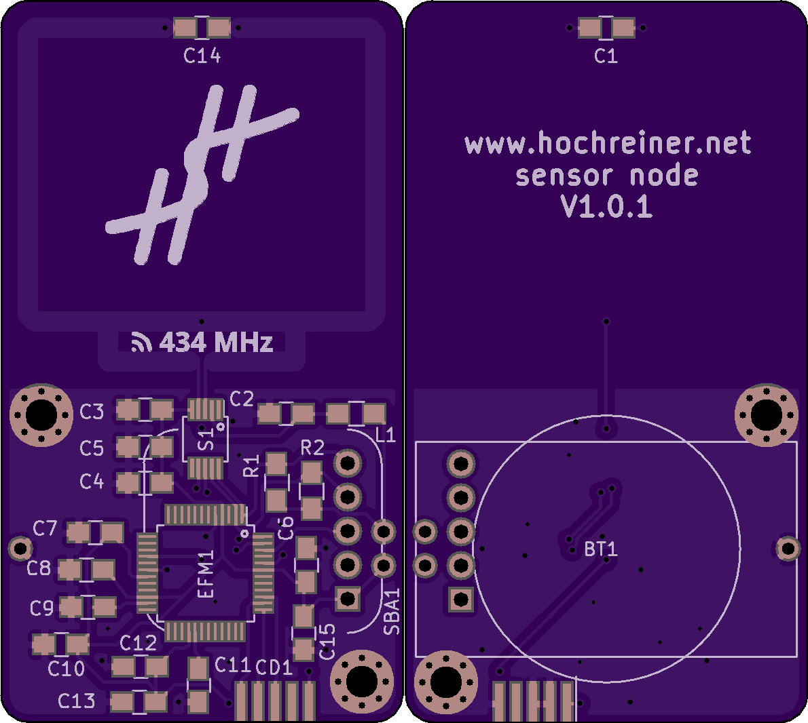

# New version of the board ordered

Today, I ordered version 1.0.1 of the board from [OSH Park](https://oshpark.com/).
With this version, I fixed the pin assignment of the radio chip, added pin 1 indicators for the MCU and the radio chip, and added more ground plane copper on the top layer.
It will probably take more than a month until I get the boards delivered, but I am really looking forward to playing with them.

