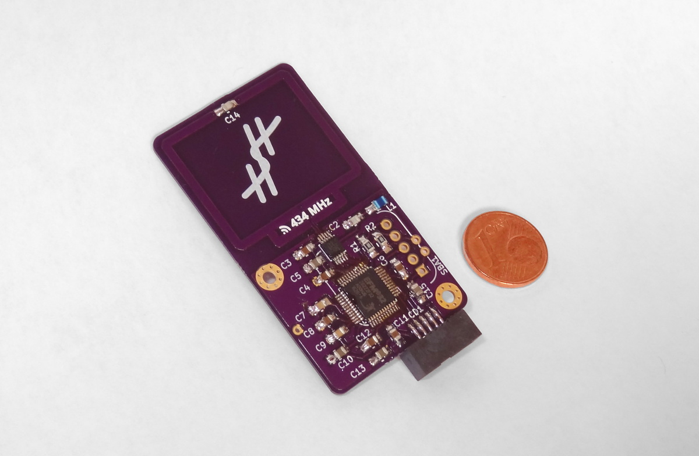

# Version 1.0.1 assembled

Today, I mostly assembled one of the version 1.0.1 boards.
For the time being, I left out the sensor socket and the battery.
The sensor I already tested and I can't attach the battery holder as long as sensor socket is not attached.

The electrical and first MCU communication tests looked ok.
Next up are the radio chip tests.
Followed, of course, by the actual radio transmission test.

